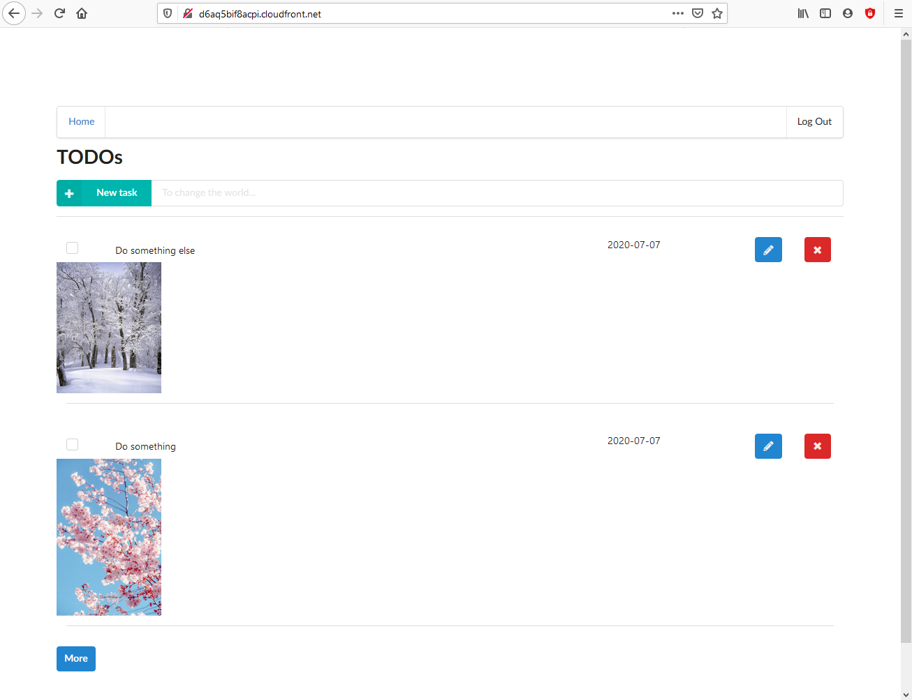
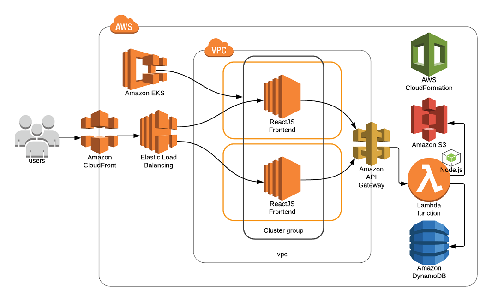
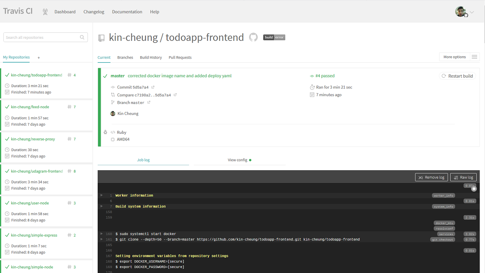
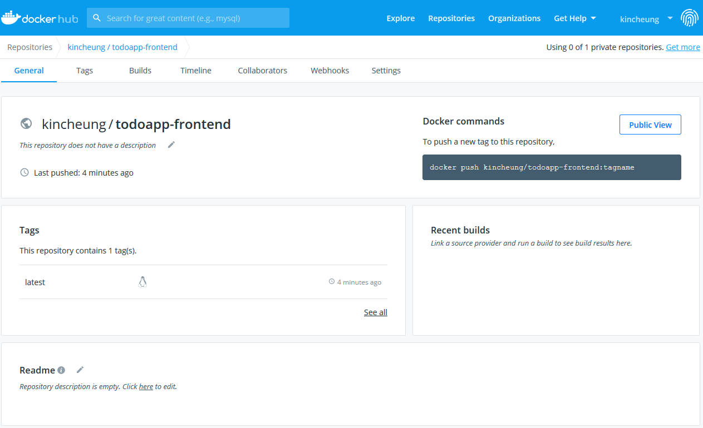

### TODO application

This is a TODO list application that is used to demonstrate a number of AWS services that were used to build the architecture for this web application.

This application is made of a web frontend and a web backend.

#### Web frontend

The web frontend is developed using [ReactJS](https://reactjs.org/). It is deployed to AWS using [AWS KMS](https://aws.amazon.com/kms/) service. CI pipeline is done by [travis.io](https://travis-ci.org/). It pulls latest source code form [Github](https://github.com/) and build a docker image before pushing it to [DockerHub](https://hub.docker.com/) to be ready for deployment, 

URL: http://d6aq5bif8acpi.cloudfront.net/

#### Web backend

The web backend is made up of a number of serverless functions using [AWS Lambda](https://aws.amazon.com/lambda/) with Node.js runtime. Along with other resources such as [S3](https://aws.amazon.com/s3/) to store images and a [DynamoDB](https://aws.amazon.com/dynamodb/) table to store TODO items, the serverless function are deployed to AWS using [Serverless framework](https://www.serverless.com/). 

##### Architectural design

##### travis-ci

##### DockerHub

