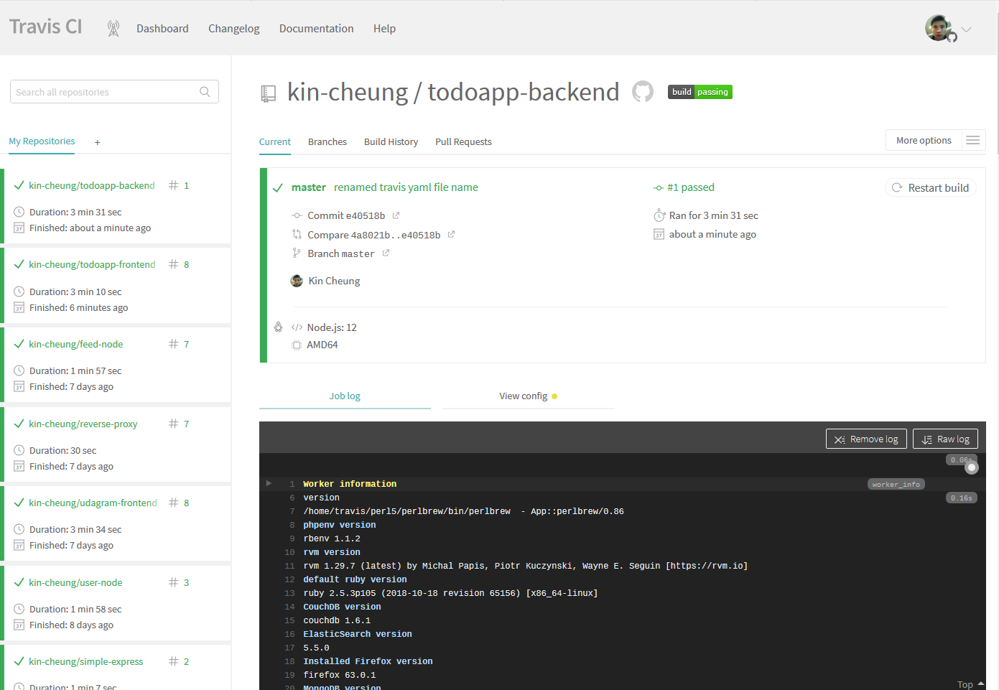

## Capstone project 

I reused the TODO app from the previous project and deployed the frontend to AWS using EKS together with travis.ci, github and dockerhub. The serverless functions for the backend also remained the same but I completely automated the CI/CD pipeline so that the serverless functions are automatically deployed to AWS when latest source is pushed to github using travis.ci.

### TODO application

This is a TODO list application that is used to demonstrate a number of AWS services that were used to build the architecture for this web application.

URL: http://d6aq5bif8acpi.cloudfront.net/

#### Architectural design

This application has a web frontend and a web backend.

#### Web frontend

The web frontend is developed using [ReactJS](https://reactjs.org/) based on the TODO app from the previous project. It is deployed to AWS using [AWS EKS](https://aws.amazon.com/eks/) service. CI pipeline is done by [travis.io](https://travis-ci.org/). It pulls latest source code form [Github](https://github.com/) and build a docker image before pushing it to [DockerHub](https://hub.docker.com/) to be ready for deployment, 
 
##### travis-ci

#### Web backend

The web backend is made up of a number of serverless functions using [AWS Lambda](https://aws.amazon.com/lambda/) with Node.js runtime. Along with other resources such as [S3](https://aws.amazon.com/s3/) to store images and a [DynamoDB](https://aws.amazon.com/dynamodb/) table to store TODO items, the serverless function are deployed to AWS using [Serverless framework](https://www.serverless.com/). CI/CD pipeline is automated by travis.io.

##### travis-ci

##### DockerHub

